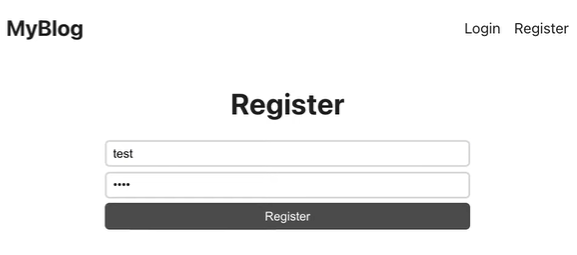

# UrbanExplorer
Create, Read, Update and Delete Blogs Online

# UrbanExplorer Project README
## Table of Contents

- [Introduction](#introduction)
- [Features](#features)
- [Technologies Used](#technologies-used)
- [Getting Started](#getting-started)
  - [Prerequisites](#prerequisites)
  - [Installation](#installation)
- [Usage](#usage)
- [Contributing](#contributing)

## Introduction

Welcome to UrbanExplorer, a full-stack blog project designed to help you explore urban environments and share your experiences with others. This project leverages various technologies to provide a seamless user experience, including user authentication, blog creation, and editing.

UrbanExplorer aims to connect urban explorers, city enthusiasts, and adventurers by offering a platform to share their urban adventures, discoveries, and insights through blog posts. Whether you're an experienced urban explorer or someone just starting to explore the city, UrbanExplorer is the perfect place to connect with like-minded individuals and showcase your urban experiences.

## Features

- **User Authentication**: Secure user registration and login functionality using JWT (JSON Web Tokens) to protect user data.
- 


- **Home Page**: Display the latest blog posts from the UrbanExplorer community for users to explore and discover.

- **Create Post**: Allow users to create and publish their own blog posts, complete with text, images, and other media.

- **Edit Posts**: Enable users to edit their own posts to keep their content up to date or make improvements.

## Technologies Used

UrbanExplorer is built using a variety of technologies and tools, including:

- **React.js**: A JavaScript library for building user interfaces, used for creating the frontend of the application.

- **Express.js**: A web application framework for Node.js, used to build the backend server.

- **Node.js**: A JavaScript runtime environment that runs on the server side, used to handle server logic.

- **JavaScript**: The primary programming language used for both frontend and backend development.

- **JWT (JSON Web Tokens)**: Used for user authentication and securing API endpoints.

- **Yarn**: A package manager for managing dependencies and scripts.

- **CORS (Cross-Origin Resource Sharing)**: Middleware for handling cross-origin HTTP requests.

## Getting Started

### Prerequisites

Before you can run UrbanExplorer on your local machine, ensure you have the following prerequisites installed:

- Node.js (v14.0 or higher)
- Yarn (optional, you can use npm if preferred)
- MongoDB (or any other preferred database)

### Installation

Follow these steps to set up and run UrbanExplorer:

1. Clone the UrbanExplorer repository to your local machine:

   ```bash
   git clone https://github.com/your-username/urbanexplorer.git
   ```

2. Navigate to the project directory:

   ```bash
   cd urbanexplorer
   ```

3. Install server dependencies:

   ```bash
   yarn install
   ```

4. Navigate to the client directory:

   ```bash
   cd client
   ```

5. Install client dependencies:

   ```bash
   yarn install
   ```

6. Return to the project root directory:

   ```bash
   cd ..
   ```

7. Create a `.env` file in the project root and set the following environment variables:

   ```env
   MONGODB_URI=your_mongodb_connection_string
   JWT_SECRET=your_jwt_secret
   ```

8. Start the server and client:

   ```bash
   yarn dev
   ```

9. Open your browser and access the application at `http://localhost:3000`.

## Usage

Once UrbanExplorer is up and running, you can:

- Register a new account or log in using existing credentials.
- Explore the latest blog posts on the home page.
- Create your own blog posts by clicking on the "Create Post" button.
- Edit your existing posts by navigating to the "My Posts" section.
- Connect with other urban explorers, share your experiences, and discover new adventures in the city.

## Contributing

Contributions to UrbanExplorer are welcome! If you'd like to contribute.

